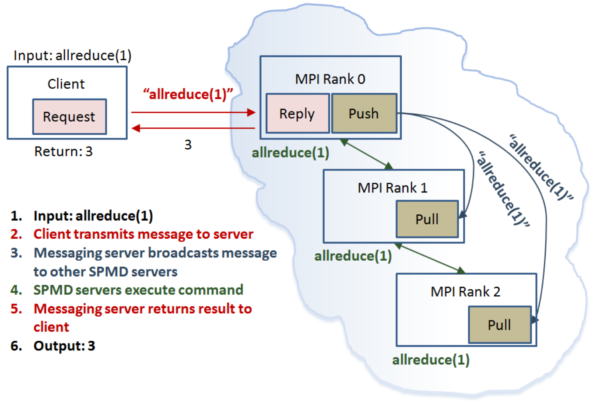

# Introduction

The **pbdCS** package [[@pbdCS]] ...

**pbdR** [[@pbdR2012]]


<center>

</center>

The spmd servers are derived from the **remoter** [[@remoter]] server, and the pbdclient is identically a **remoter** client.  Communication is handled by **ZeroMQ** [[@zeromq]] via R package **pbdZMQ** [[@Chen2015pbdZMQpackage]].  Our use of pbdZMQ is specialized to client/server communications, but the package is very general.  For more details about **pbdZMQ** see the **pbdZMQ** package vignette [[@Chen2015pbdZMQvignette]].


## Installation
You can install the stable version from CRAN using the usual `install.packages()`:

```r
install.packages("pbdCS")
```

The development version is maintained on GitHub.  You can install this version using the `devtools` package:

```r
devtools::install_github("RBigData/pbdCS")
```


# Using the pbdserver

## Background

TODO
remoter
The `password`, `maxretry`, `secure`, `log`, `verbose`, and `showmsg` options are identical to those in `remoter::server`.  There are several key differences in the pbdserver, however.

First, there are two ports, `port` and `remote_port`.

TODO
`bcaster`
For more information, see the Implementation Details section below.


## Launching
There are two ways to launch the servers: via `mpirun` from the shell, and via `pbdSpawn()` from R.  To do the former, issue

```bash
mpirun -np 2 Rscript -e "pbdserver()"
```

passing arguments to `pbdserver()` as usual.  To launch from R directly:

```r
pbdSpawn()
```

To use `pbdSpawn()` from the terminal, do not combine with `mpirun`.  Instead issue:

```bash
Rscript -e "pbdSpawn()"
```


## Connecting
Use `pbdCS::pbdclient()` or `remoter::client()` as when connecting to a **remoter** server.


# Implementation Details

TODO: explain bcaster

<center>

</center>

The above shows an example with a single input and its corresponding return return.  Here, the user enters `allreduce(1)` from **pbdMPI**, which will use communication between the SPMD servers to return the total number of servers running.  The client captures this input and passes it along to rank 0 of the SPMD servers.  Then, using the push/pull sockets, the client's message is broadcast from rank 0 to all other SPMD servers.  Finally, the command is evaluated, and the result from rank 0 is returned to the client.  This pattern assumes that the `bcaster` method used when setting up the servers was `zmq`.  If `mpi` is chosen, then the push/pull communication is replaced by an MPI `bcast()` call.


# Legal

&copy; 2016 Drew Schmidt.

Permission is granted to make and distribute verbatim copies of this vignette and its source provided the copyright notice and this permission notice are preserved on all copies.

Work for the **pbdCS** package is supported in part by the project *Harnessing Scalable Libraries for Statistical Computing on Modern Architectures and Bringing Statistics to Large Scale Computing* funded by the National Science Foundation Division of Mathematical Sciences under Grant No. 1418195.

Any opinions, findings, and conclusions or recommendations expressed in  this material are those of the authors and do not necessarily reflect the  views of the National Science Foundation.  The findings and conclusions in this article have not been formally disseminated by the U.S. Department of Health \& Human Services nor by the U.S. Department of Energy, and should not be construed to represent any determination or policy of University, Agency, Adminstration and National Laboratory.

This manual may be incorrect or out-of-date.  The authors assume no responsibility for errors or omissions, or for damages resulting from the use of the information contained herein.

Opening image is a modification from the CC0 'licensed' file https://pixabay.com/en/client-server-networking-laptop-341420/


# References
<script language="JavaScript" src="include/headers.js"></script>
